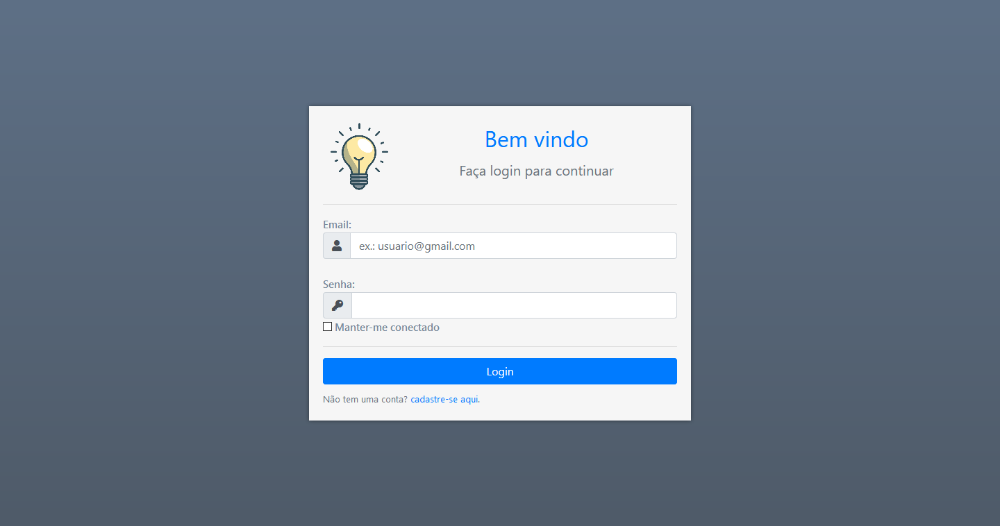

# Project Maker info

## Intuito do site
Esse projeto foi criado com o intuito de minha aprendizagem sobre as tecnologias utilizadas no desenvolvimento web tanto na parte de **front end**, quanto **back end**. Não tenho nenhum intuito de ferir algum direito autoral de imagem.

## tecnologias usadas
- HTML
- CSS
- JavaScript
- PHP
- MySql
- **bibliotecas**
    - jQuery
    - Bootstrap
    - [fontAwesome](https://fontawesome.com/)

## Sobre o site
O propósito do site é permitir o usuário organizar seus projetos de vida com informações completas de modo que depois ele possa voltar no site para consultar seus projetos criados de modo organizado, elegante e bem estruturado. As informações básicas de funcionamento e criação do projeto estão nessa página:

O site conta com o armazenamento dos projetos de forma persistente no banco de dados, de modo que o usuário possa consultar seus projeto em qualquer dispositivo (suporte visual para dispositivos de todos os tamanhos), desde que ele entre com sua conta ~~Isso caso eu pague um domínio para o site.~~
A visualização dos projetos inicialmente é simplificada, mostrando apenas as informações principais, porém é possível expandir esse projeto clicando no botão "_exibir_" mostrando assim as informações completas
É possível excluir e editar o projeto facilmente, clicando nos respectivos botões.

Para isso a aplicação conta com um sistema de login, totalmente integrado com o banco de dados, contando com um sistema de **session** e armazenamento em **cookies** caso o usuário marque o "_mater-me conectado_".

Também é possível cadastrar uma nova conta para o site facilmente, infelizmente não há a confirmação de e-mail para cadastro

Para criação do projeto há um formulário que o usuário preenche com as informações que ele acha relevantes. Alguns campos são obrigatórios e outros opcionais. O formulário tem toda a validação necessária para o usuário não colocar nenhuma informação errada.

Por fim a maior parte dos arquivos que fazem conexões com o banco de dados(PHP), inserem e recuperam as informações e estabelecem a lógica da sessão do login estão na pasta _logica_ 
A estrutura e o relacionamento das tabelas do banco de dados são estabelecidos assim:

Caso queira ter a estrutura do banco de dados para testar no seu próprio localhost apenas copie as queries desse [arquivo](bd_project_maker_database.txt)
 
