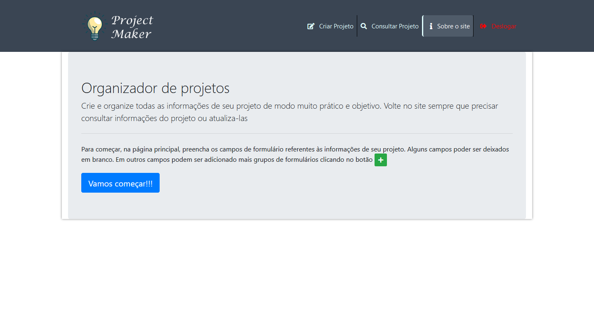
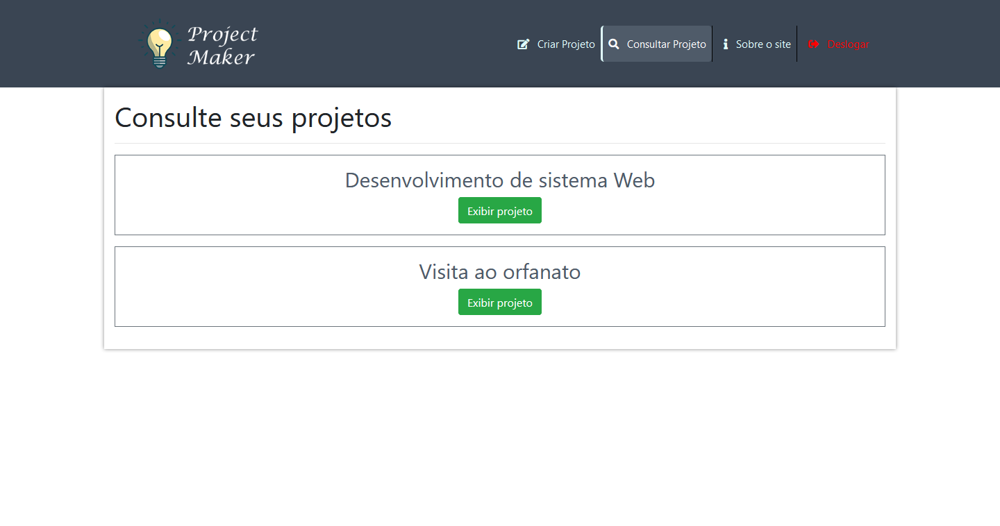
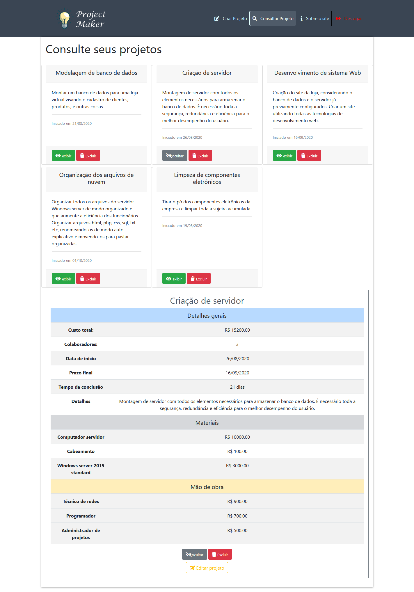
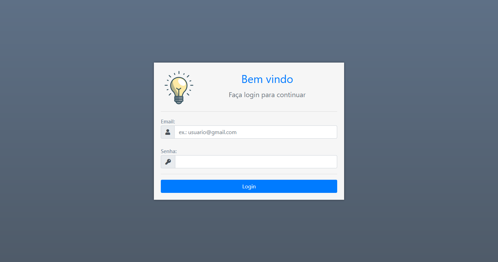
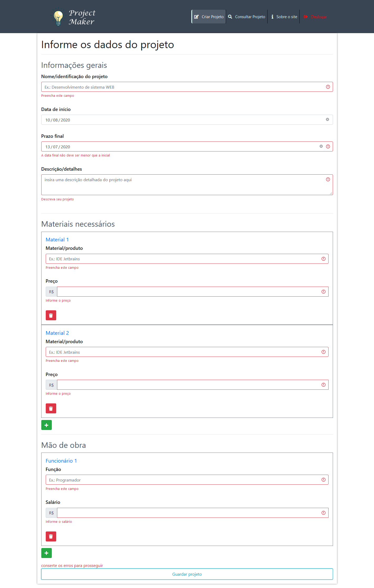
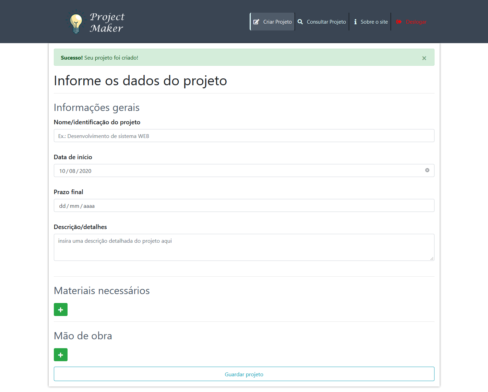

# Project Maker info

## Intuito do site
Esse projeto foi criado com o intuito de minha aprendizagem sobre as tecnologias utilizadas no desenvolvimento web tanto na parte de **front end**, quanto **back end**. Não tenho nenhum intuito de ferir algum direito autoral de imagem.

## tecnologias usadas
- HTML
- CSS
- JavaScript
- PHP
- MySql
- **bibliotecas**
    - jQuery
    - Bootstrap
    - [fontAwesome](https://fontawesome.com/)

## Sobre o site
O propósito do site é permitir o usuário organizar seus projetos de vida com informações completas de modo que depois ele possa voltar no site para consultar seus projetos criados de modo organizado, bonito e bem estruturado. As informações básicas de funcionamento e criação do projeto estão nessa página:

O site conta com o armazenamento dos projetos de forma persistente no banco de dados, de modo que o usuário possa consultar seus projeto em qualquer dispositivo (suporte visual para dispositivos de todos os tamanhos), desde que ele entre com sua conta ~~Isso caso eu pague um domínio para o site.~~

Para isso a aplicação conta com um sistema de login, totalmente integrado com o banco de dados. ~~Ainda falta a opção de criar conta~~

Para criação do projeto há um formulário que o usuário preenche com as informações que ele acha relevantes. Alguns campos são obrigatórios e outros opcionais. O formulário tem toda a validação necessária para o usuário não colocar nenhuma informação errada.

Por fim a maior parte dos arquivos que fazem conexões com o banco de dados(PHP), inserem e recuperam as informações e estabelecem a lógica da sessão do login estão na pasta _logica_ 
A estrutura e o relacionamento das tabelas do banco de dados são estabelecidos assim:

Caso queira baixar o arquivo .sql do banco de dados para testar no seu próprio localhost [está disponível](bd_project_maker.sql)

## Nota
As contas criadas para fazer login no index.php estão presentes no banco de dados na tabela "usuarios"

### conta 1
**E-mail:** user@teste.com
**senha:** 1234

### conta 2
**E-mail:** jose@teste.com.br
**senha:** 1234
 
